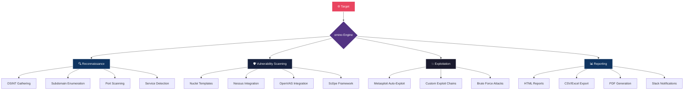
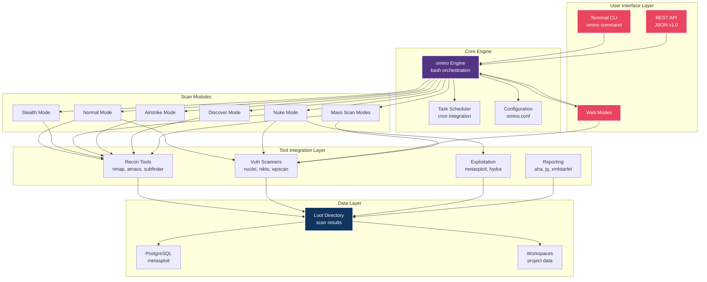
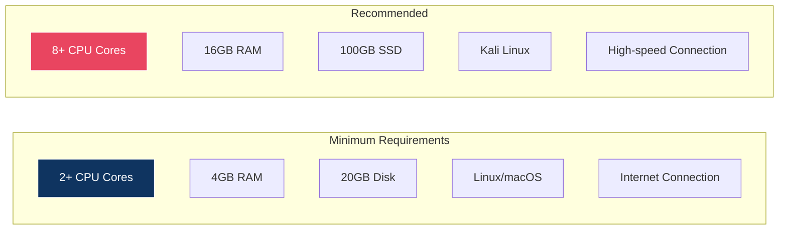
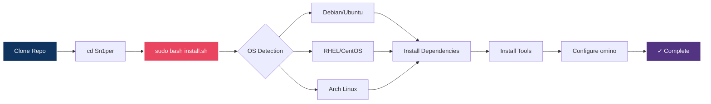
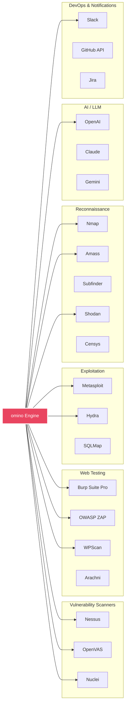
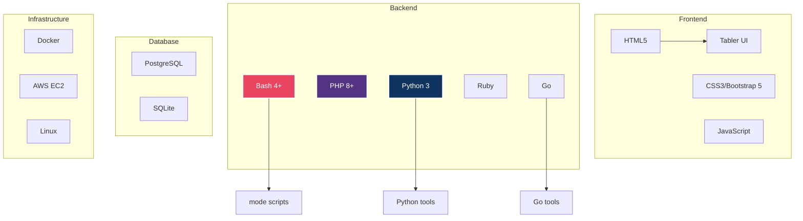

```mermaid
graph TD
    omino[omino command] --> TARGET[-t TARGET]
    omino --> MODE[-m MODE]
    omino --> FILE[-f targets.txt]
    omino --> WORKSPACE[-w WORKSPACE]
    omino --> OPTIONS[Additional Options]
    
    TARGET --> DOMAIN[Domain/IP]
    TARGET --> CIDR[CIDR Range]
    
    MODE --> NORMAL[normal]
    MODE --> STEALTH[stealth]
    MODE --> NUKE[nuke]
    MODE --> AIRSTRIKE[airstrike]
    MODE --> DISCOVER[discover]
    MODE --> WEB[web/webscan]
    MODE --> MASS[massweb/massvulnscan]
    
    OPTIONS --> BRUTE[-b Bruteforce]
    OPTIONS --> OSINT[-o OSINT]
    OPTIONS --> RECON[-re Recon]
    OPTIONS --> FULLPORT[-fp Full Port]
    OPTIONS --> VERBOSE[-v Verbose]
    OPTIONS --> DEBUG[-db Debug]
    
    style omino fill:#e94560,stroke:#fff,stroke-width:3px,color:#fff
    style TARGET fill:#533483,stroke:#fff,stroke-width:2px,color:#fff
    style MODE fill:#0f3460,stroke:#fff,stroke-width:2px,color:#fff
    style OPTIONS fill:#16213e,stroke:#fff,stroke-width:2px,color:#fff
```    

<div align="center">


</div>

# 🜛 omino — The Eye That Sees All


<div align="center">

<!-- ANIMATED HEADER -->


<!-- ANIMATED EYE SVG -->
<br/>

```
 ██████╗ ███╗   ███╗██╗███╗   ██╗ ██████╗ 
██╔═══██╗████╗ ████║██║████╗  ██║██╔═══██╗
██║   ██║██╔████╔██║██║██╔██╗ ██║██║   ██║
██║   ██║██║╚██╔╝██║██║██║╚██╗██║██║   ██║
╚██████╔╝██║ ╚═╝ ██║██║██║ ╚████║╚██████╔╝
 ╚═════╝ ╚═╝     ╚═╝╚═╝╚═╝  ╚═══╝ ╚═════╝ 
```

**`🜛 Black Hat Edition · 🜛`**

*"In the shadows, it watches. In silence, it learns. When the time comes, it strikes."*

<br/>

<!-- BADGES ROW 1 -->
[](https://github.com/Athexblackhat/omino/releases)
[](LICENSE.md)
[](https://github.com/Athexblackhat/omino/issues)
[](https://github.com/Athexblackhat/omino/graphs/contributors)

<!-- BADGES ROW 2 -->
[](https://github.com/Athexblackhat/omino/stargazers)
[](https://github.com/Athexblackhat/omino/network/members)
[](https://twitter.com/xer0dayz)
[](https://hub.docker.com)

<br/>

<!-- TYPING ANIMATION -->
<a href="https://git.io/typing-svg">
  
</a>

<br/><br/>

<!-- QUICK LINKS -->
[📖 Docs](https://github.com/Athexblackhat/omino/wiki) · [🚀 Install](#-installation) · [🎯 Quick Start](#-quick-start) · [🔗 Integrations](#-integrations) · [💬 Community](#-community--support) · [💲 Pricing](https://https://github.com/Athexblackhat)

</div>



---

## 📑 Table of Contents

<details>
<summary><b>Click to expand</b></summary>

- [🌟 Overview](#-overview)
- [⚡ What's New ](#-whats-new-in-omino)
- [🏗️ Architecture](#️-architecture)
- [🚀 Installation](#-installation)
- [🎯 Quick Start](#-quick-start)
- [🗺️ Scan Modes](#️-scan-modes)
- [🔗 Integrations](#-integrations)
- [📖 Usage Guide](#-usage-guide)
- [🛠️ Developer Guide](#️-developer-guide)
- [🤝 Contributing](#-contributing)
- [👥 Team](#-team--contributors)
- [⚖️ License & Legal](#️-license--legal)

</details>

---

## 🌟 Overview

<div align="center">

|  🔥 500+ Teams  |  🔌 90+ Integrations  |  🎯 10,000+ Detections  |  💥 600+ Exploits  |  📅 Since 2026  |
|:-:|:-:|:-:|:-:|:-:|

</div>

**omino** is an enterprise-grade offensive security platform that consolidates reconnaissance, vulnerability scanning, exploitation, and reporting into a single unified workspace. Born from the legendary omino engine and reborn as **omino Black Hat Edition**, it represents over a decade of red team operations distilled into one powerful tool.

> 🛡️ Built by pentesters, for pentesters. Battle-tested in the field. Trusted by security teams worldwide.

### 🔥 Core Capabilities

<div align="center">

| Category | What omino Does |
|---|---|
| 🔍 **Reconnaissance** | OSINT, subdomain enumeration, port scanning, service detection |
| 🛡️ **Vulnerability Assessment** | Automated scanning, manual verification, risk scoring, FP reduction |
| 💥 **Exploitation** | Metasploit integration, custom exploit chains, brute force, post-exploitation |
| 📊 **Reporting** | Real-time dashboards, exportable reports, compliance mapping, team collaboration |

</div>

---


</div>

### 🆕Release Highlights

<details open>
<summary><b>🎨 Complete Rebranding</b></summary>

omino evolves with stunning new ASCII art, animated terminal UI, and the Black Hat Edition theme.

</details>

<details>
<summary><b>🐳 Docker-First Deployment</b></summary>

Single universal image for all distributions with Docker Compose orchestration. Spin up in seconds.

</details>

<details>
<summary><b>🖥️ Multi-Distribution Support</b></summary>

Native packages and auto-detection for:

- **Debian / Ubuntu / Kali** — APT-based
- **RHEL / CentOS / Fedora** — RPM-based
- **Arch / Manjaro** — Pacman-based
- **macOS** — Homebrew-based

</details>

<details>
<summary><b>🔌 JSON REST API v1.0</b></summary>

Full programmatic access for CI/CD pipelines, SOAR, and SIEM integration.

```json
{
  "api_version": "1.0",
  "endpoints": {
    "scans":      "/api/v1/scans",
    "workspaces": "/api/v1/workspaces",
    "reports":    "/api/v1/reports",
    "targets":    "/api/v1/targets"
  },
  "authentication": "Bearer Token",
  "rate_limit":     "100 requests/minute"
}
```

</details>

<details>
<summary><b>📦 Expanded Modules</b></summary>

ReverseAPK · MassPwn · Threat Intelligence · Nessus · Burp Suite · AI/LLM integrations

</details>

---

## 🏗️ Architecture



---

## 🚀 Installation

### System Requirements



---

### 🐧 Linux (Debian · RHEL · Arch)

```bash
# Clone the repository
git clone https://github.com/Athexblackhat/omino.git
cd omino

# Interactive installer — auto-detects your distro
sudo bash install.sh

# Or force install without prompts
sudo bash install.sh force
```



---

### 🐳 Docker

```bash
# Kali Linux base image
sudo docker compose up
sudo docker run --privileged -it omino-kali-linux /bin/bash

# BlackArch base image
sudo docker compose -f docker-compose-blackarch.yml up
sudo docker run --privileged -it omino-blackarch /bin/bash
```

---

### 🍎 macOS

```bash
# Install Homebrew
/bin/bash -c "$(curl -fsSL https://raw.githubusercontent.com/Homebrew/install/HEAD/install.sh)"

# Clone and install
git clone https://github.com/Athexblackhat/omino.git
cd omino && sudo bash install.sh
```

---

### ☁️ AWS Marketplace

1. Search **omino** on AWS Marketplace → **Continue to Subscribe**
2. Choose region and instance type → **Continue to Launch**
3. SSH to the EC2 public IP — omino is preinstalled

---

## 🎯 Quick Start

```bash
# Basic scan
omino -t example.com -m normal

# Full audit with workspace
omino -t example.com -m nuke -w myproject

# Stealth recon with OSINT
omino -t example.com -m stealth -o -re

# Multi-target from file
omino -f targets.txt -m airstrike

# Check status
omino --status

# Update omino
omino -u
```

> 📁 Results stored in `/usr/share/omino/loot/<workspace>/`

---

## 🗺️ Scan Modes

<div align="center">

| Mode | Description | Aggression | Noise |
|---|---|:-:|:-:|
| `normal` | Active + passive scan | 🟡 Medium | 🟡 Medium |
| `stealth` | Low-profile enumeration | 🟢 Low | 🟢 Low |
| `flyover` | Fast multi-threaded scans | 🟡 Medium | 🟡 Medium |
| `airstrike` | Port enum + fingerprinting | 🔴 High | 🔴 High |
| `nuke` | **Full audit, everything on** | 🔴 Maximum | 🔴 Maximum |
| `discover` | CIDR walk on all live hosts | 🔴 High | 🔴 High |
| `port` | Targeted single-port scan | 🟢 Low | 🟢 Low |
| `web` | Web app scan on 80/443 | 🟡 Medium | 🟡 Medium |
| `webscan` | Full HTTP+HTTPS via Burp+Arachni | 🔴 High | 🔴 High |
| `vulnscan` | OpenVAS vulnerability assessment | 🔴 High | 🟢 Low |
| `mass*` | Multi-target variants of all modes | 🔴 High | 🔴 High |

</div>

---

## 📖 Usage Guide

<details>
<summary><b>🔍 Reconnaissance Modes</b></summary>

```bash
# Normal mode — active + passive
omino -t <TARGET>
omino -t <TARGET> -o -re

# Stealth mode — low profile
omino -t <TARGET> -m stealth -o -re

# Discover mode — CIDR range
omino -t <CIDR> -m discover -w <WORKSPACE>
```



</details>

<details>
<summary><b>🎯 Targeted Modes</b></summary>

```bash
# Specific port scan
omino -t <TARGET> -m port -p <PORT>

# Full port scan
omino -t <TARGET> -fp

# Web mode — ports 80 + 443
omino -t <TARGET> -m web

# HTTP web scan on specific port
omino -t <TARGET> -m webporthttp -p <PORT>

# HTTPS web scan on specific port
omino -t <TARGET> -m webporthttps -p <PORT>

# Full web application scan
omino -t <TARGET> -m webscan
```

</details>

<details>
<summary><b>💥 Aggressive Modes</b></summary>

```bash
# Enable bruteforce
omino -t <TARGET> -b

# Airstrike — fast multi-target
omino -f targets.txt -m airstrike

# Nuke — full audit with everything
omino -f targets.txt -m nuke -w <WORKSPACE>
```

</details>

<details>
<summary><b>📊 Mass Scan Modes</b></summary>

```bash
omino -f targets.txt -m massportscan  -w <WORKSPACE>
omino -f targets.txt -m massweb       -w <WORKSPACE>
omino -f targets.txt -m masswebscan   -w <WORKSPACE>
omino -f targets.txt -m massvulnscan  -w <WORKSPACE>
```

</details>

<details>
<summary><b>🗂️ Workspace Management</b></summary>

```bash
omino --list                                  # List workspaces
omino -w <WORKSPACE> -d                       # Delete workspace
omino -w <WORKSPACE> -t <TARGET> -dh          # Delete host
omino -w <WORKSPACE> -t <TARGET> -dt          # Delete tasks
omino -w <WORKSPACE> --export                 # Export workspace
omino -w <WORKSPACE> --reimport               # Reimport loot
omino -w <WORKSPACE> --reimportall            # Reimport all loot
```

</details>

<details>
<summary><b>⚙️ Scheduling & Config</b></summary>

```bash
omino -c /path/to/omino.conf -t <TARGET> -w <WORKSPACE>

omino -w <WORKSPACE> -s daily    # Schedule daily scans
omino -w <WORKSPACE> -s weekly   # Schedule weekly scans
omino -w <WORKSPACE> -s monthly  # Schedule monthly scans
```

</details>

---

## 🔗 Integrations



omino orchestrates **90+ industry-standard tools** across 6 categories:

<div align="center">

| Category | Tools |
|---|---|
| 🛡️ **Vulnerability Scanners** | Nessus · OpenVAS · GVM 21.x · Nuclei |
| 🌐 **Web App Testing** | Burp Suite Pro · OWASP ZAP · WPScan · Arachni · Nikto |
| 💥 **Exploitation** | Metasploit · Hydra · SQLMap · John the Ripper |
| 🔍 **Reconnaissance** | Nmap · Masscan · Amass · Subfinder · Shodan · Censys |
| 🤖 **AI / LLM** | OpenAI · Claude · Gemini |
| 📣 **Notifications** | Slack · GitHub API · Jira · Email |

</div>

---

## 🛠️ Developer Guide

### Adding a New Scan Mode

**1. Create** `modes/yourmode.sh`:

```bash
#!/bin/bash
# omino — Your Mode Description

function yourmode {
    echo -e "${OKBLUE}[*]${RESET} Starting yourmode on $TARGET"

    # Your scanning logic
    nmap -sV $TARGET -oN $LOOT_DIR/nmap/nmap-$TARGET.txt

    echo -e "${OKGREEN}[✓]${RESET} yourmode complete"
}
```

**2. Register** in `omino`:

```bash
source modes/yourmode.sh

if [[ "$MODE" == "yourmode" ]]; then
    yourmode
fi
```

**3. Document** in the `help()` function:

```bash
$star YOUR MODE
omino -t <TARGET> -m yourmode
```

### Technology Stack



### Pull Request Process

```
Fork repo → Create feature branch → Commit changes → Push → Open PR → CI passes → Review → Merge
```

```bash
git checkout -b feature/amazing-feature
git commit -m 'Add amazing feature'
git push origin feature/amazing-feature
# Then open a Pull Request on GitHub
```

---

## 🤝 Contributing

We welcome contributions from the security community. omino is what it is thanks to **35+ contributors** worldwide.

| How to Help | Details |
|---|---|
| 🐛 **Bug Reports** | [Open an issue](https://github.com/Athexblackhat/omino/issues) with reproduction steps |
| ✨ **Feature Requests** | Open an issue with `[Feature]` prefix |
| 🔧 **Code** | New modes, bug fixes, optimizations — see Developer Guide |
| 📝 **Docs** | Wiki updates, examples, tutorials |
| 🧪 **Testing** | Verify on multiple distributions |

> For major changes, open an issue first to discuss your proposed design.

---

## 👥 Team & Contributors

<div align="center">

<table>
<tr>
<td align="center">
<br/>
<b>@Athexblackhat</b><br/>
<sub>Creator & Lead Developer</sub><br/>
<a href="https://github.com/Athexblackhat">GitHub</a>.
</td>
<td align="center">
<br/>
<b>DIR CYBER</b><br/>
<sub>Forensic Investigator</sub><br/>
<a href="https://github.com/">GitHub</a>
</td>
</tr>
</table>
</div>

---

## 📚 Documentation

| Document | Description |
|---|---|
| [Getting Started](https://github.com/Athexblackhat/omino/wiki/Getting-Started) | Quick start for new users |
| [Installation](https://github.com/Athexblackhat/omino/wiki/Installation) | Detailed installation guide |
| [Configuration](https://github.com/Athexblackhat/omino/wiki/Configuration) | All config options explained |
| [Usage](https://github.com/Athexblackhat/omino/wiki/Usage) | Complete usage reference |
| [Architecture](https://github.com/Athexblackhat/omino/wiki/Architecture) | System design and internals |
| [Integrations](https://github.com/Athexblackhat/omino/wiki/Integrations) | Third-party tool guide |
| [Troubleshooting](https://github.com/Athexblackhat/omino/wiki/Troubleshooting) | Common issues and fixes |

---

## 📰 News & Releases

| Date | Release | Highlights |
|---|---|---|
| **April 2026** | omino Black Hat Edition | Complete rebranding, animated UI, multi-distro |
| **February 2026** | SILENTCHAIN AI CE v1.1.3 | AI-powered chain analysis |
| **January 2026** | omino SE v11.0 | Enterprise features, API v1.0 |

[View all releases →](https://github.com/Athexblackhat/omino/releases)

---

## 💬 Community & Support

<div align="center">

[](https://github.com/Athexblackhat/omino/issues)
[](https://youtube.com/@inziXploit444)
[](https://github.com/Athexblackhat/omino/wiki)

</div>

---

## ⚖️ License & Legal

This project is licensed under the **MIT License** — see [LICENSE.md](LICENSE.md) for details.

Third-party tool notices: [THIRD\_PARTY\_LICENSES.md](THIRD_PARTY_LICENSES.md)

**Trademark:** "omino" and the omino logo are trademarks of ominoSecurity LLC. Use in derivative works requires permission. Contact: [https://github.com/Athexblackhat](https://https://github.com/Athexblackhat)

---

> **⚠️ AUTHORIZED USE ONLY**
>
> omino is designed for authorized security testing only. You are responsible for obtaining proper authorization before testing any systems. Unauthorized scanning of systems you do not own or have explicit permission to test is **illegal** and may result in criminal prosecution. The developers assume no liability for misuse or damage caused by this tool.

---

<div align="center">


**🜛 omino — The Eye That Sees All 🜛**

*Built by pentesters. For pentesters. Since 2015.*

[](https://github.com/Athexblackhat/omino/stargazers)
[](https://github.com/Athexblackhat/omino/network/members)
[](https://twitter.com/xer0dayz)

`penetration-testing` `offensive-security` `attack-surface-management` `vulnerability-scanner` `recon` `osint` `red-team` `bug-bounty` `security-tools` `exploitation` `automation`

</div>
